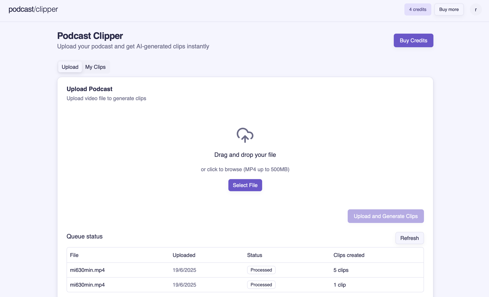
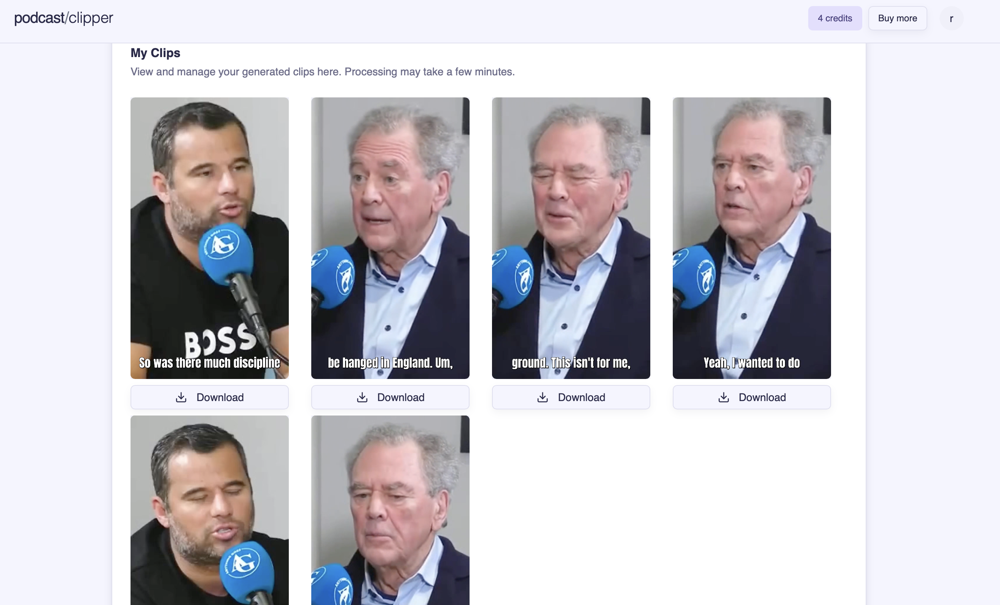
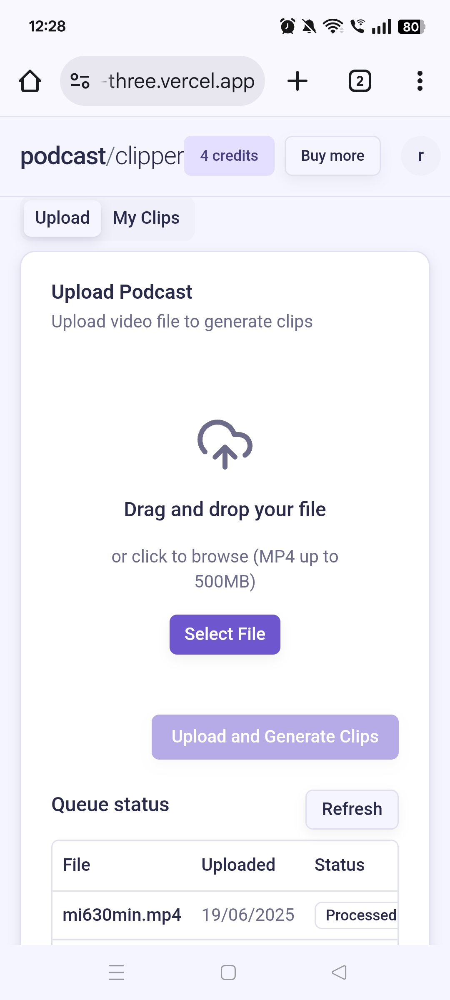
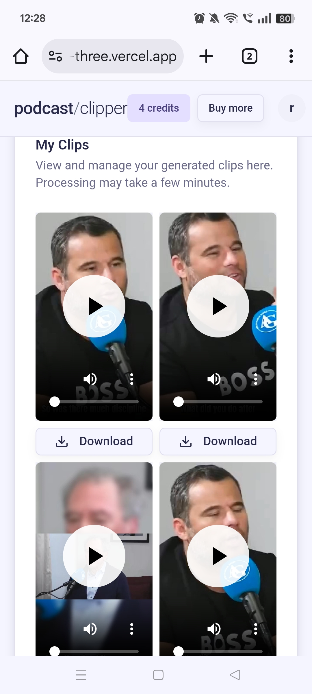

# AI Podcast Clipper

## Overview

In this project, we build a SaaS application that converts full podcasts into viral short-form clips ready for YouTube Shorts or TikTok. The tool uses different AI models to transcribe the video, automatically detect the most engaging moments in podcasts and create clips cropped to the active speaker's face. We used technologies such as Next.js 15, React, Typescript, Tailwind CSS, ShadCN, Auth.js, Python, FastAPI, Modal, Inngest, S3 on AWS and more.

Features:

- 🎬 Auto-detection of viral moments in podcasts (stories, questions, etc.)
- 🔊 Automatically added subtitles on clips
- 📝 Transcription with m-bain/whisperX
- 🎯 Active speaker detection for video cropping with Junhua-Liao/LR-ASD
- 📱 Clips optimized for vertical platforms (TikTok, YouTube Shorts)
- 🎞️ GPU-accelerated video rendering with FFMPEGCV
- 🧠 LLM-powered viral moment identification with Gemini 2.5 Pro
- 📊 Queue system with Inngest for handling user load
- 👤 User authentication system
- 📱 Responsive Next.js web interface
- 🎛️ Dashboard to upload podcasts and see clips
- ⏱️ Inngest for handling long-running processes
- ⚡ Serverless GPU processing with Modal
- 🌐 FastAPI endpoint for podcast processing
- 🎨 Modern UI with Tailwind CSS & Shadcn UI

## 🌐 Web Interface

<p float="left">
  
  
</p>

## 📱 Mobile Interface

<p float="left">
  
  
</p>

## 🎬 Generated Short Clips


## Setup

Follow these steps to install and set up the project.

### Clone the Repository

```bash
git clone --recurse-submodules https://github.com/rumenguin/ai-podcast-clipper.git
```

### Install Python

Download and install Python if not already installed. Use the link below for guidance on installation:
[Python Download](https://www.python.org/downloads/)

Create a virtual environment with **Python 3.12**.

### Backend

Navigate to backend folder:

```bash
cd ai-podcast-clipper-backend
```

Install dependencies:

```bash
pip install -r requirements.txt
```

Clone the [LR-ASD](https://github.com/Junhua-Liao/LR-ASD) repo into the backend folder, and rename the folder asd:

```bash
git clone https://github.com/Junhua-Liao/LR-ASD.git
```

Modal setup:

```bash
modal setup
```

Run on Modal:

```bash
modal run main.py
```

Deploy backend:

```bash
modal deploy main.py
```

### Frontend

Install dependencies:

```bash
cd ai-podcast-clipper-frontend
npm i
```

Run:

```bash
npm run dev
```

### Queue

Run the local queue development server with Inngest:

```bash
cd ai-podcast-clipper-frontend
npm run inngest-dev
```

## AWS Setup

CORS policy for S3 bucket:

```bash
[
    {
        "AllowedHeaders": [
            "Content-Type",
            "Content-Length",
            "Authorization"
        ],
        "AllowedMethods": [
            "PUT"
        ],
        "AllowedOrigins": [
            "*"
        ],
        "ExposeHeaders": [
            "ETag"
        ],
        "MaxAgeSeconds": 3600
    }
]
```

IAM user policy to upload, download and list bucket items:

```bash
{
    "Version": "2012-10-17",
    "Statement": [
        {
            "Effect": "Allow",
            "Action": [
                "s3:ListBucket"
            ],
            "Resource": "[S3 ARN here]"
        },
        {
            "Effect": "Allow",
            "Action": [
                "s3:GetObject",
                "s3:PutObject"
            ],
            "Resource": "[S3 ARN here]/*"
        }
    ]
}
```

## LLM for viral moment identification

[Create an API key for Gemini](https://ai.google.dev/gemini-api/docs/quickstart?lang=python)

# Videos used for testing

[MI6 Secret Agent Talks About the World's Darkest Secrets](https://www.youtube.com/watch?v=-vMgbJ6WqN4)

[Janney Sanchez | Therapy saved my life, From Rivera to Sanchez , Living in my Moms Shadow | Ep.198](https://www.youtube.com/watch?v=SOG0GmKts_I)
